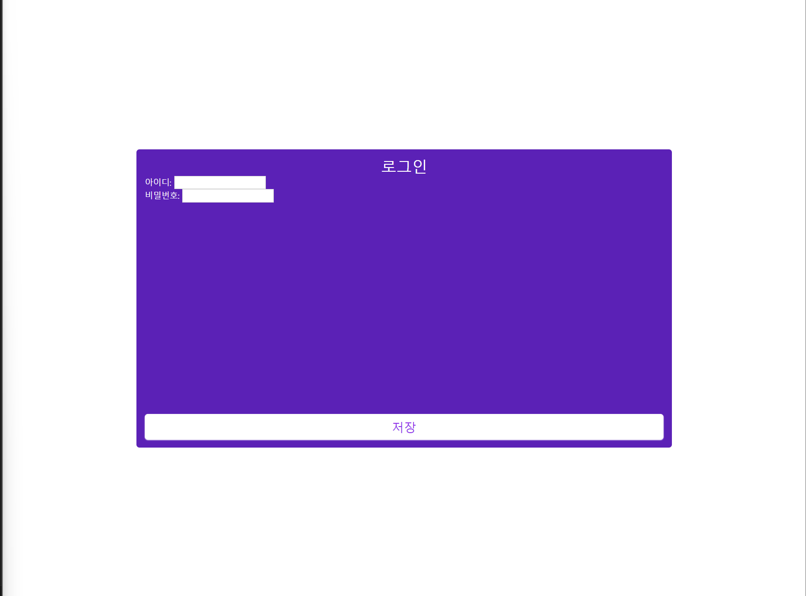

# 요구사항 


- 실제 서비스중인 페이지로 생각하시고 작업해주시면 됩니다  
    - 이후 해당 작업물은 다른 사람에게 인수인계 예정이라는 상황  
- 렌더링을 절대적으로 최소화 하시오  
    - App.tsx 파일은 상당히 많은 컴포넌트가 들어있다는 가정이며 현재 input 액션이 일어날때마다 렌더링 되고 있는 이슈가 발생 되고 있습니다. 이를 절대적으로 최소화 하시오  
    - 마찬가지로 사용되고 있는 모든 컴포넌트 역시 렌더링을 절대적으로 최소화 하시오  
- 저장 버튼을 클릭시 api 를 호출한다.  
    - 저장 버튼은 반드시 컴포넌트로 `분리` 되어 있어야 한다  
    - 저장 버튼 클릭시 `아이디`, `이름`의 값을 클릭이벤트에서 알고 있어야 함.  
- 검증 로직이 포함되어 있어야한다  
    - `아이디`, `이름`은 최소 3자 이상  
    - 실패시 실시간으로 사용자에게 알려야함  
- 위 조건이 지켜지는 범위 내에서 `타입`, `컴포넌트` 등 원하시는 것들을 자유롭게 추가 변경 가능
- 라이브러리 사용을 허용함.  
- `strict 모드가 꺼져 있으니 참고해주세요.`
- 실제 api는 존재 하지 않으며 주석처리로 해두시면 됩니다
---
`api 호출 예제`
```Typescript
const someClickEvent = () => {
    // someApi(someValidValue)
}
```

